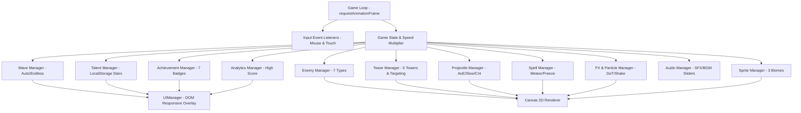

# 📐 Architecture Canvas - 2D Engine

```mermaid
graph TD
    A[Game Loop - requestAnimationFrame] --> B[Input Event Listeners - Mouse & Touch]
    A --> C[Game State & Speed Multiplier]
    C --> D[Wave Manager - Auto/Endless]
    C --> E[Enemy Manager - 7 Types]
    C --> F[Tower Manager - 5 Towers & Targeting]
    C --> G[Projectile Manager - AoE/Slow/Crit]
    C --> H[Spell Manager - Meteor/Freeze]
    C --> I[FX & Particle Manager - DoT/Shake]
    C --> J[Talent Manager - LocalStorage Stars]
    C --> K[Achievement Manager - 7 Badges]
    C --> L[Analytics Manager - High Score]
    C --> M[Audio Manager - SFX/BGM Sliders]
    C --> N[Sprite Manager - 3 Biomes]
    
    E --> O[Canvas 2D Renderer]
    F --> O
    G --> O
    H --> O
    I --> O
    N --> O
    D --> P[UIManager - DOM Responsive Overlay]
    J --> P
    K --> P
    L --> P
```
