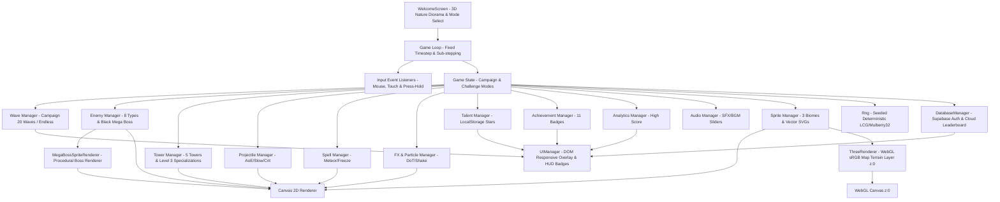

# 📐 Architecture Canvas - 2D Engine

---

## 🧩 Descrição dos Módulos Principais

* **`WelcomeScreen` (Three.js & Retro UI):** Tela inicial com background 3D diorama low-poly de natureza (ilha flutuante, pinheiros, sol bucólico com efeito bloom e partículas de vaga-lumes), menu de início, seleção de modo (Campanha ou Infinito com Desafios) e perfil do jogador.
* **`Game` & `GameState`:** Motor principal com timestep fixo e sub-stepping para simulação fluida em 2x e 4x sem perda de física.
* **`DatabaseManager`:** Integração com Supabase para autenticação anônima persistente, sincronização cloud de conquistas e placar global (Leaderboard).
* **`Specializations`:** Sistema de ramificação de upgrades para torres no nível 3 com habilidades ativas e passivas únicas.
* **`Rng`:** Gerador pseudo-aleatório semeado (Mulberry32) para partidas determinísticas e simulação headless.
* **`MegaBossSpriteRenderer`:** Renderizador procedural otimizado com transparência para o chefão `BLACK_MEGA_BOSS`.
* **`ThreeRenderer`:** Renderizador WebGL (Three.js) dedicado aos tiles do mapa na camada inferior (`z-index: 0`) com texturas configuradas em `THREE.SRGBColorSpace` para fidelidade sRGB de cores.

---

## ⚡ Estabilidade do Vite HMR & Resolução de Dependências Circulares

Para garantir que o Hot Module Replacement (HMR) do Vite funcione de forma determinística em ambiente de desenvolvimento sem erros de avaliação de módulo em tempo de recarga (`Uncaught SyntaxError: ... does not provide an export named ...`), a árvore de dependências do projeto segue regras de desacoplamento unidirecional:

1. **Inversão de Dependência entre `UIManager` e `Game` (`IGame2D`):**
   - O `UIManager` não importa o tipo nem a classe concreta de `Game.ts`. Em vez disso, ele declara a interface `IGame2D` em `src/ui/UIManager.ts`.
   - A classe `Game2D` em `src/engine/Game.ts` assina a interface (`implements IGame2D`), eliminando o ciclo de importação cruzada entre Engine e UI.

2. **Centralização de Tipos Compartilhados em `src/types.ts`:**
   - Interfaces de dados e enumerações estruturais compartilhadas (como `TalentData` e `TileType`) foram centralizadas em `src/types.ts`.
   - `TalentManager.ts` e `MapManager.ts` re-exportam esses tipos para manter retrocompatibilidade com chamadas de testes e componentes externos sem reintroduzir ciclos estáticos no bundler.
