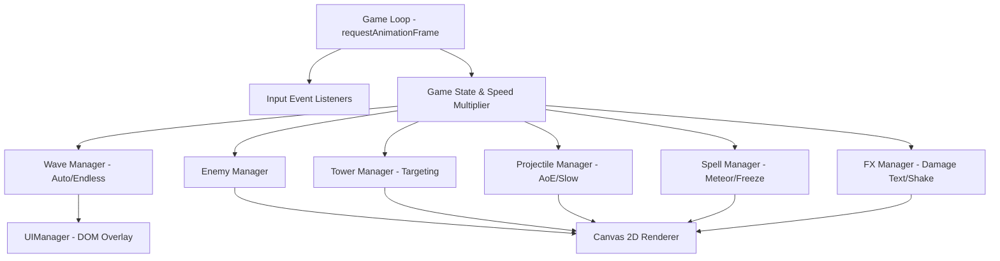

# 📐 Architecture Canvas - 2D Engine

```mermaid
graph TD
    A[Game Loop - requestAnimationFrame] --> B[Input Event Listeners]
    A --> C[Game State & Speed Multiplier]
    C --> D[Wave Manager - Auto/Endless]
    C --> E[Enemy Manager]
    C --> F[Tower Manager - Targeting]
    C --> G[Projectile Manager - AoE/Slow]
    C --> H[Spell Manager - Meteor/Freeze]
    C --> I[FX Manager - Damage Text/Shake]
    
    E --> J[Canvas 2D Renderer]
    F --> J
    G --> J
    H --> J
    I --> J
    D --> K[UIManager - DOM Overlay]
```
