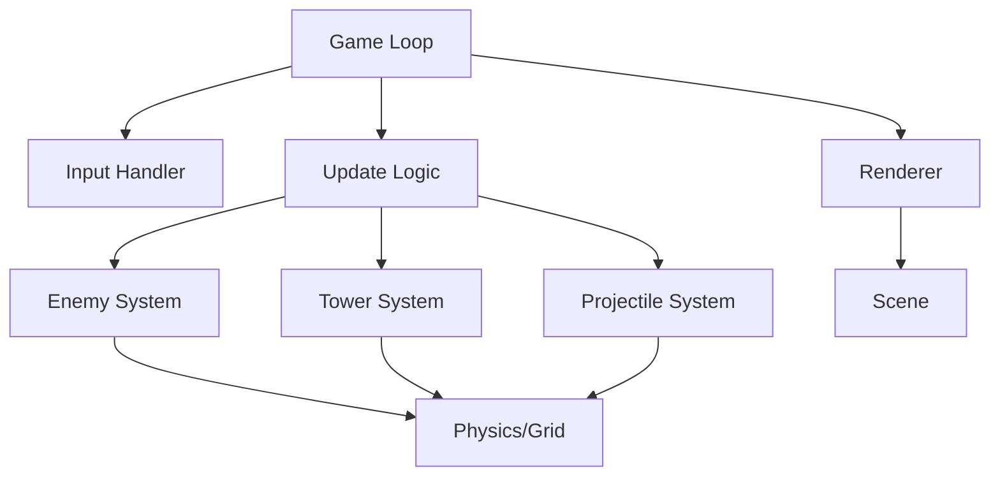

# 📐 Architecture Canvas

```mermaid
graph TD
    A[Game Loop] --> B[Input Handler]
    A --> C[Update Logic]
    C --> D[Enemy System]
    C --> E[Tower System]
    C --> F[Projectile System]
    D --> G[Physics/Grid]
    E --> G
    F --> G
    A --> H[Renderer]
    H --> I[Scene]
```
